**调制**：调制的含义在一般语境中并不明确，维基百科的定义是： modulation is the process of varying one or more properties of a periodic waveform, called the carrier signal, with a modulating signal that typically contains information to be transmitted.这是综合了模拟调制技术和数字调制技术的定义。要明确理解调制有必要回顾重要调制技术及其历史。  
模拟调制技术（AM，FM，PM）：19世纪20年代左右出现的调制技术，其特点是将模拟信号直接控制载波的幅度，频率，相位，然后在无线信道中传播。  

**数字调制技术**：模拟调制技术主要的缺点是抗干扰能力较差，针对模拟调制技术的不足，19世纪30年代提出了脉冲编码调制（PCM）技术，奠定的数字调制技术的基础。PCM技术包含抽样，量化，编码等过程（**与ADC的区别？**）。和模拟调制类似，将数字信号控制成型脉冲的幅度，频率和相位的基带调制方式称之为ASK，FSK和PSK，以及同时幅度和相位信息的QAM技术。数字信号要在无线信道中传输，还需要将基带信号搬移到载波频率上，这一步骤与模拟调制相似。因此相比于模拟调制，数字调制出于各种目的，将信息发射出去这一过程做了细化。

PCM编码调制：这种调制技术把模拟信源信息无失真的转化为二进制信源信息，然后加上脉冲成型，并进行载波搬移，从而在信道中传输。

ASK/FSK/PSK：在脉冲成型时，用0，1序列控制脉冲的幅度就是ASK，控制频率就是FSK，而控制相位就是PSK。用二进制序列来控制脉冲只有两种状态，一种更高效的方式是用多个比特来形成多种状态，控制脉冲的幅度/频率/相位。

QAM：同时控制幅度和相位的调制方法就是QAM技术。

**调制的数学意义** ：广义的调制可以认为是一个集合向另一个集合的映射。PCM是把模拟信源映射为数字信源，先进行低通滤波，再量化，最后编码，低通滤波回丢失高频信息，量化会产生量化误差，而编码操作是无损的。因此从这个角度看PCM是有损调制技术。调制可以表示为：
$$
y=f(x)
$$

**线性调制**：输入信息与输出信息满足$f(x_1)+f(x_2)=f(x_1+x_2)$，这种调制方式称为线性调制。

**相位连续性** ：成型脉冲的持续时间为1个符号，如果当前符号结束时刻的相位与下个符号开始时的相位不相同，就称为相位不连续，反之成为相位是连续的，成型脉冲相位连续的优点是频域的旁瓣较窄，带外干扰较小。

**有记忆性**：调制的输出取决于调制的输入，根据输入的类型，可以将调制类型分为有记忆调制和无记忆调制，如果当前输出仅与当前时刻输入有关，称之为无记忆调制：
$$
y_n=f(x_n)
$$
如果当前时刻的输出受到前面时刻的影响，称为有记忆调制：
$$
y_n=f(x_n,x_{n-1},...)
$$
